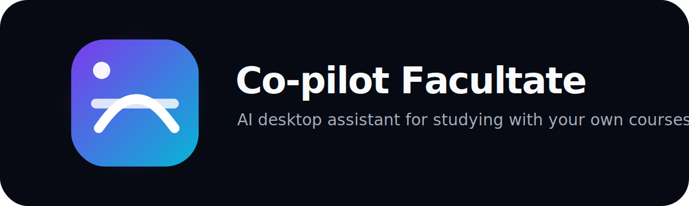
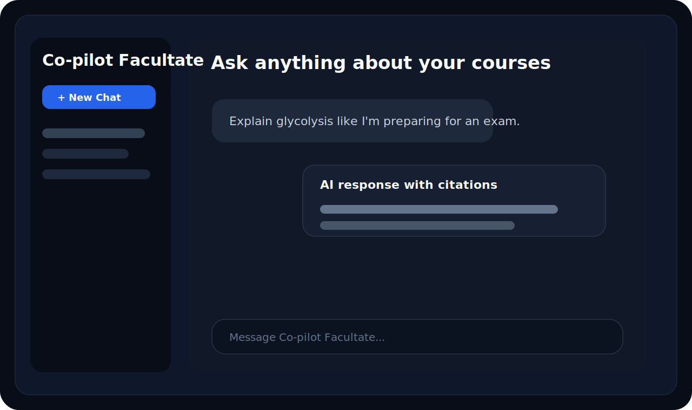

# Co-pilot Facultate

<p align="center">
  
</p>

<p align="center">
  <a href="https://github.com/stxfanee/ai-facultate/releases/latest">
    
  </a>
</p>

**Co-pilot Facultate** is a Windows desktop study assistant for students who want to chat with their course PDFs, keep study notes, generate quizzes and review progress. The desktop app can either run the AI server on the owner?s PC or connect as a lightweight client from another computer.

<p align="center">
  
  <br>
  <em>Desktop app with chat-first course assistance.</em>
</p>

## Quick start

1. Download **Co-pilot Facultate Setup.exe** from the [latest release](https://github.com/stxfanee/ai-facultate/releases/latest).
2. Install and launch **Co-pilot Facultate**.
3. Choose or create a profile.
4. Start chatting with the AI.

If no release is available yet, build locally from the repository root:

```powershell
.\scriptsuilduild_desktop_app.bat
```

Build output:

```text
dist/
  Co-pilot Facultate Setup.exe      # when Inno Setup is installed
  Co-pilot Facultate Portable.exe
  Co-pilot Facultate.exe
```

## What it does

- Chat with uploaded course PDFs and receive citations.
- Keep separate users, workspaces, chats, documents and memory.
- Generate flashcards, quizzes and study session plans.
- Track progress, weak topics and study history.
- Use local Ollama models on the server PC; client PCs do not download models.
- Share the server through Cloudflare Tunnel or Tailscale Funnel without router port forwarding.

## Modes

| Mode | Use case | What runs locally |
| --- | --- | --- |
| Server mode | Desktop PC that owns the RTX/Ollama setup | Ollama, FastAPI, Streamlit, ChromaDB and optional tunnel |
| Client mode | Laptop or friend?s PC | Only the desktop client; it connects to the public HTTPS URL |

The desktop PC is the only AI server. Clients never run Ollama or ChromaDB.

## Architecture

```text
Client app / browser
        |
        | HTTPS
        v
Cloudflare Tunnel or Tailscale Funnel
        |
        v
Desktop server PC
  - Co-pilot Facultate Server Mode
  - Streamlit web UI
  - FastAPI API
  - Ollama local models
  - ChromaDB vector store
  - per-user storage
```

## Public access

Use Cloudflare Tunnel or Tailscale Funnel. Do not expose raw local ports on the router.

Recommended flow:

1. Run **Co-pilot Facultate** on the desktop PC.
2. Select Server Mode.
3. Enable public access with Cloudflare Tunnel.
4. Copy the HTTPS public URL.
5. Share it only with trusted people until password-based authentication is enabled.

No-password profiles are useful for local/LAN/Tailscale testing. Public deployments should enable real authentication before wider use.

## Local model notes

Default routing is `Auto`:

- `qwen3:8b` for simple chat, normal RAG, quizzes and flashcards.
- `qwen3:14b` for harder reasoning, planning and professor-style explanations.
- Mistral Small 3.2 24B can be selected manually and can be enabled for Auto only after a local benchmark.

For RTX 3070 8GB, prefer quantized models and expect larger models to be slower or to offload to RAM.

## Factual reliability

For exact technical questions, Co-pilot Facultate uses deterministic tools for unit conversions and trusted constants instead of relying only on model memory. If an exact value is not supported by uploaded documents or trusted constants, the assistant should state uncertainty rather than inventing a value.

Run the local factual benchmark:

```powershell
.\.venv\Scripts\python.exe scriptsenchmark_factual_reliability.py
```

The report is written to `storage/benchmarks/factual_reliability_latest.json`.

## Current status and limitations

- Windows is the primary supported platform.
- The installer requires Inno Setup locally; otherwise the portable executable is still built.
- Authentication infrastructure exists, but no-password profiles are still the default for local testing.
- Public sharing should be limited to trusted users until authentication is enabled.
- Large local models can be slow on 8 GB VRAM.

## Roadmap

- Password-based public profiles.
- More reliable named Cloudflare Tunnel setup from the desktop app.
- Better release automation for installer artifacts.
- More document viewer polish and citation navigation.
- Broader factual tool coverage for scientific calculations.

## Development

Documentation lives in [`docs/`](docs/):

- [Installation](docs/INSTALLATION.md)
- [Client usage](docs/CLIENT.md)
- [Server operation](docs/SERVER.md)
- [Deployment](docs/DEPLOYMENT.md)
- [Architecture](docs/ARCHITECTURE.md)
- [Development](docs/DEVELOPMENT.md)
- [Troubleshooting](docs/TROUBLESHOOTING.md)
- [Chat UX checklist](docs/CHAT_UX_CHECKLIST.md)
- [Releases](docs/RELEASES.md)

Run tests:

```powershell
.\.venv\Scripts\python.exe -m unittest discover -s tests -v
```

Build the desktop app:

```powershell
.\scriptsuilduild_desktop_app.bat
```

This project is developed with AI assistance. Changes are reviewed, tested and kept in ordinary source control rather than treated as generated throwaway output.

## License

See [LICENSE](LICENSE).
